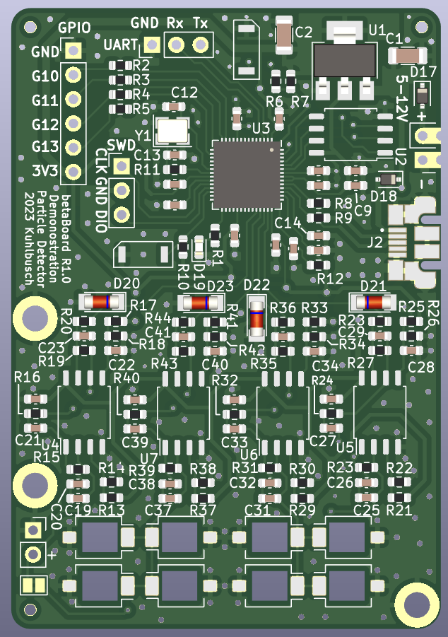
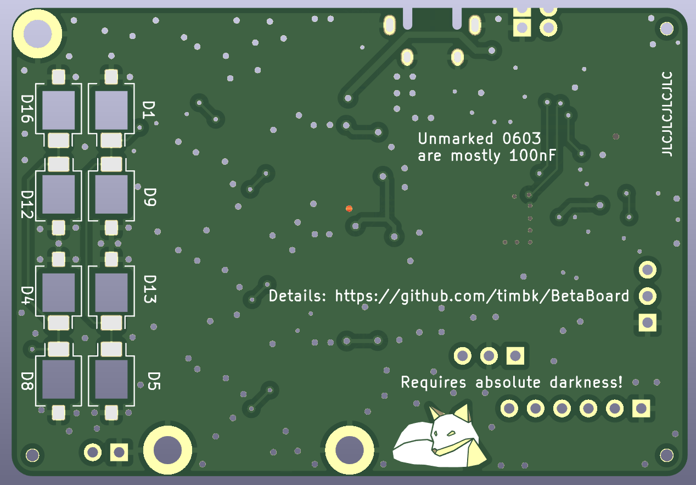

# BetaBoard

A particle detector built for cost-effectiveness when ordered at O(100) pieces.

The detector concept is adapted from the [DIY Particle Detector Project](https://github.com/ozel/DIY_particle_detector) by Oliver Keller.

## PCB

[Schematic](betaBoard/pdf/betaBoard_sch.pdf)
[Layout](betaBoard/pdf/betaBoard_pdf.pdf)

The goal was to keep it small to keep the PCB cost low and to make it fit easily.
Components were chosen to keep the price low and based on availablility at the chosen manufacturer.

Design concepts:
* 4 Channels
    * adding channles came without significant cost (only opamps and passives)
    * 2 Channel on the back are expensive to populate
* Header to connect PD with leads
* External power header for up to 12 V to increase diode bias
* RP2040 allows simple programming via USB
    * Can be done by the user without special tools
* Allow options for different diode placement
    * More diodes yield more sensitivity

## Ideas

* Strip detector with 4 pixels?
* File down SMD LEDs for less absorption?
* 3D-Printed Case?
* Interconnect multiple detectors?

## R2.0 ideas

* Put VCC on interconnect instead of 3V3
* Review diode cutout size
* Increase power supply castellated hole distance
* Increase LDO heat sink plane size
* Think about how usefull the coincidence concept is: 2x2 = 2+2 = 4!
* Silk to highlight Diode grouping
* Seperate bulk capacitor on 5V rail for analog

## R1.0 Notes

* MCU, buttons, USB etc work perfectly out of the box :D
* High USB noise (1kHz spikes)
    * R14 requires a parallel C to get rid of noise from USB line
        * 1uF seems to help but does not seem sufficient (Could try 10uF, have 0603)
        * could increase R by factor 10
    * TODO: Try larger bulk capacitance (100uF or 1000uF)
        * Might be change in current draw
        * Cable length (resistance) seems to have an effect
    * TODO: Try if battery operation is better (helps to exclude potential points where 1 kHz noise couples)
* Is 40 MOhm working with the input impedance of LM358??
* Cut up groundplane at the PDs is probably not optimal
* Keep loop areas even smaller (I don't think it's the source of issues, but would feel better)

## Experiment Ideas

* Time distribution of pulses
* Rate vs distance (1/d^2 + offset)
* Spectroscopy?? (alphas, sand down diode?
* Balloon in cellar
