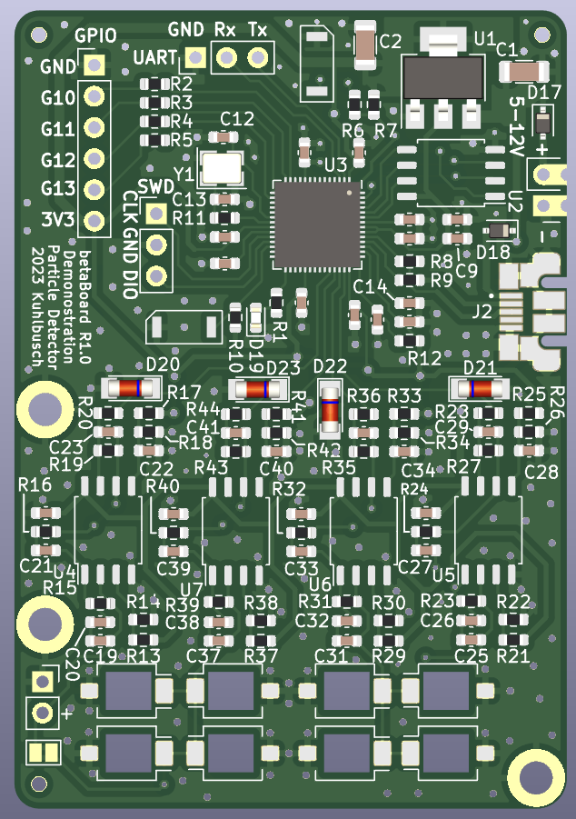
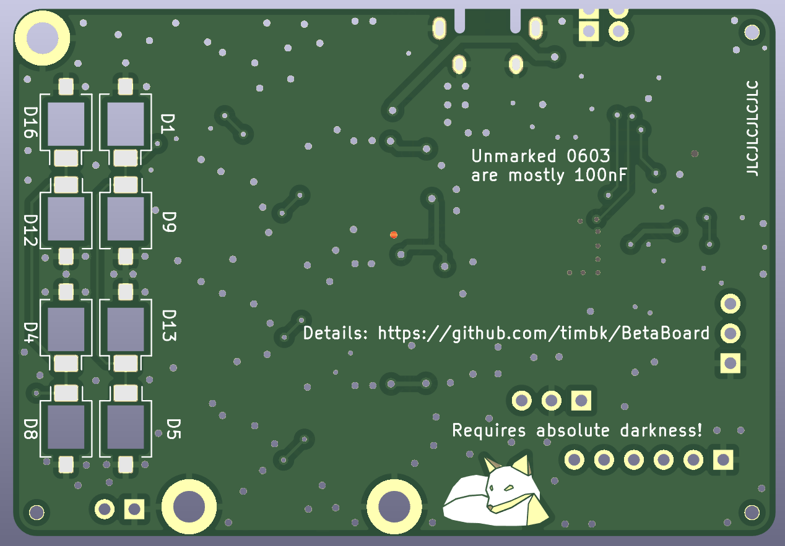
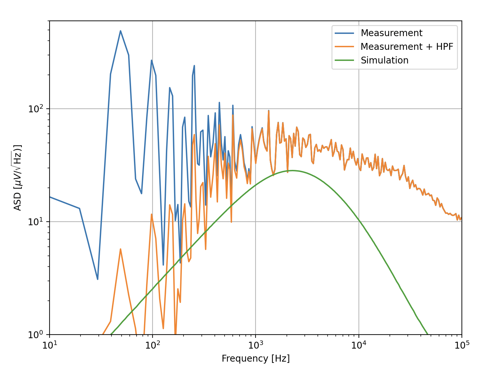

# BetaBoard

A particle detector built for cost-effectiveness when ordered at O(100) pieces.

The detector concept is adapted from the [DIY Particle Detector Project](https://github.com/ozel/DIY_particle_detector) by Oliver Keller.

## Experiment Ideas

* Time distribution of pulses
* Rate vs distance (1/d^2 + offset)
* Absorption coefficient
    * Increase material thickness between detector and source
* Spectroscopy?? (alphas, sand down diode?
* Balloon in cellar

## Serial interface

* `T` `T <block_index> <timestamp_us> <overflow> # <sample_0> <sample_1> .. <sample_N>`
    * `block_index`: uint16_t, mainly relevant for debugging
    * `timestamp_us`: uint64_t, Trigger point timestamp in micro seconds since start of the measurement
    * `overflow`: bool, set to 1 if an overflow happend prior to this sample
    * `sample_n`:  int16_t, samples from the triggered waveform

## PCB

[Schematic](betaBoard/pdf/betaBoard_sch.pdf)
[Layout](betaBoard/pdf/betaBoard_pdf.pdf)

The goal was to keep it small to keep the PCB cost low and to make it fit easily.
Components were chosen to keep the price low and based on availablility at the chosen manufacturer.

## Ideas

* Strip detector with 4 pixels?
* File down SMD LEDs for less absorption?
* 3D-Printed Case?
* Interconnect multiple detectors?

## R2.0 ideas

* Put VCC on interconnect instead of 3V3
* Review diode cutout size
* Increase power supply castellated hole distance
* Increase LDO heat sink plane size
* Think about how usefull the coincidence concept is: 2x2 = 2+2 = 4!
* Silk to highlight Diode grouping
* Seperate bulk capacitor on 5V rail for analog

## Noise calculations

* Spice simulation: peak of ca. 40 $\mu\text{V}/\sqrt{\text{Hz}}$
    * Resistor thermal noise: $\sqrt{4k_BTR}\approx 400 ~ \text{nV/}\sqrt{\text{Hz}}$
    * LM358 input noise is ca. 40 $\text{nV}/\sqrt{\text{Hz}}$
    * Gain of second stage is ca. 100 for the peak frequency
    * => Resistor thermal noise is dominant part in simulation, LM385 noise should be negligible
        * $100 \cdot 400~\text{nV}/\sqrt{\text{Hz}} \approx 40~\mu\text{V}/\sqrt{\text{Hz}}$

## Potential signal sources

* 10g KCl has ca. 164 Bq.
* Estimate of geometric acceptency at 2 cm distance: $A = \frac{4 \cdot 7.5~\text{mm}^2} {4\pi\cdot (20~\text{mm})^2} \approx 0.006$
    * With perfect efficiency: ca. 1 Hz
